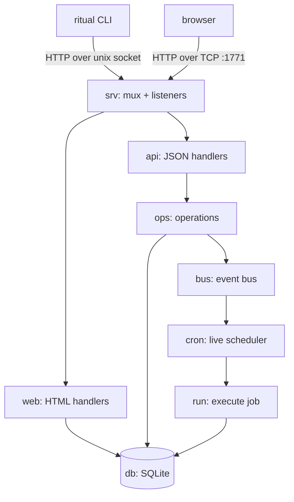

# Ritual — package docs

Ritual is a Go cron/job manager: it stores job definitions in SQLite, runs their
commands on a schedule (locally now, remote-over-SSH soon), records every run, and
exposes all of it through a CLI, a unix-socket control plane, and a web UI.

One process — the **daemon** (`ritual serve`) — owns the live scheduler and is the
runtime SQLite writer. The **CLI** talks to that daemon over a unix socket; if the
daemon is down it falls back to writing the DB directly.

## The packages

| Package | Doc | What it does |
| --- | --- | --- |
| `main` (root) | [main.md](main.md) | Process entrypoint: open the DB, run the CLI. |
| `cmd` | [cmd.md](cmd.md) | Cobra commands: `serve` (daemon) + `import`/`export`/`run`/`create`. |
| `codec` | [codec.md](codec.md) | Convert job definitions ↔ cron/TOML/YAML files; job hashing. |
| `internal/db` | [db.md](db.md) | The only thing that touches SQLite. Job/Run models + CRUD. |
| `internal/run` | [run.md](run.md) | Execute a job's command and record the run (local; SSH planned). |
| `internal/cron` | [cron.md](cron.md) | Wraps robfig/cron; keeps the live schedule in sync with the DB. |
| `internal/bus` | [bus.md](bus.md) | In-process pub/sub event bus connecting mutations to the scheduler. |
| `internal/ops` | [ops.md](ops.md) | Shared, transport-free operations layer (the "verbs"). |
| `internal/api` | [api.md](api.md) | Thin JSON HTTP handlers over `ops`, served on the socket/TCP. |
| `internal/web` | [web.md](web.md) | HTML UI: embedded templates + handlers. |
| `internal/srv` | [srv.md](srv.md) | Owns the mux + the two listeners (unix socket + TCP). |

## How a request flows

## Related design docs

- [../EXPLAIN.md](../EXPLAIN.md) — deep dive on job execution + the SSH/remote design.
- [../TODO.md](../TODO.md) — current bugs and planned features (referenced throughout).

> **Status:** Ritual is mid-build. Each package doc has a "Status & future" section
> noting what's real vs. planned. Where a doc cites a known bug it points at
> `TODO.md`, which is the source of truth for the work queue.
</content>
