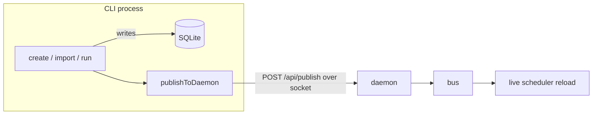

# `cmd`

**Files:** `cmd/root.go`, `cmd/serve.go`, `cmd/cli.go`

## Purpose

Defines the Cobra command tree — everything you can type after `ritual`. Two very
different kinds of command live here:

- **`serve`** — starts the long-lived **daemon** (scheduler + servers).
- **`import` / `export` / `run` / `create`** — short-lived **CLI** commands that
  manipulate jobs and then notify the daemon.

## How it works

### `root.go`
Declares `rootCmd` (`ritual`) whose only behavior is to print help. `Execute()` is
what `main` calls. Subcommands attach themselves via `init()` in the other files.

### `serve.go` — the daemon
`ritual serve` wires the whole runtime together and then blocks:

```go
cron, _ := cron.MakeRunner()   // build scheduler from the DB
bus.MakeBus()                  // create the global event bus
srv.MakeMux()                  // build the shared HTTP mux

go bus.CronSubscription(cron, bus.LifeCycle, bus.Database)  // scheduler consumes events
cron.Cron.Start()              // start robfig's background clock
go srv.SocketServe()           // unix-socket control plane
go srv.WebServe()              // TCP web UI

ctx, stop := signal.NotifyContext(ctx, os.Interrupt, SIGTERM)
<-ctx.Done()                   // the one intentional block
```

So the daemon = one scheduler + one event-bus consumer + two HTTP listeners, all
held up by a single signal-driven block.

### `cli.go` — the management verbs
- **`import [path|dir]`** (`-c` for crontab): reads files (or `crontab -l`), picks a
  [codec](codec.md) by file extension, unmarshals to `Definition`s, converts to
  `db.Job`, and `CreateJob()`s each. Defaults to `$RITUAL_CRON_PATH` when no path is
  given.
- **`export <type> [ids…]`** (`-b` for one batch file): loads jobs, converts to
  `Definition`s, marshals via the chosen codec, writes per-job files (or one
  `batch.<type>`).
- **`run <id>`**: loads the job and executes it *right now* via [`run`](run.md)
  (same `localhost` dispatch the scheduler uses).
- **`create <name> <schedule> <host> <commands> [envfile]`**: builds a `db.Job` and
  `CreateJob()`s it.

Each verb that changes data calls **`publishToDaemon`**, which is the CLI→daemon
bridge: it marshals the affected job IDs into an `ops.RequestBody` and `POST`s it to
`http://unix/api/publish` through [`srv.NewSocketClient`](srv.md). If the socket
can't be reached it logs a warning and returns nil — the direct DB write already
happened, so the change isn't lost; the daemon just won't hear about it until
restart.



## Status & future

- **Missing verbs:** `list`, `delete`, and `edit` have DB support but no CLI surface
  yet (TODO — Features).
- **Mutations don't yet route *through* the daemon ops layer.** `create`/`run`/
  `import` write the DB directly and then merely *notify* via `/api/publish`. The
  intended end state is CLI → `ops` over the socket, with the direct DB write kept
  only as the daemon-down fallback (`/api/jobs/new` exists but is currently unused
  from the CLI — TODO).
- `run` and `export` publish events that are effectively no-ops; flagged for cleanup
  in TODO.
- The `localhost`-literal dispatch in `run` shares the [`run`](run.md)/[`cron`](cron.md)
  `isLocal` bug.
</content>
