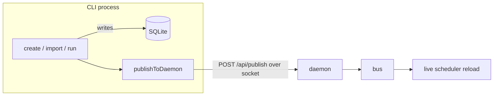

# `cmd`

**Files:** `cmd/root.go`, `cmd/serve.go`, `cmd/jobs.go`, `cmd/hosts.go`

## Purpose

Defines the Cobra command tree — everything you can type after `ritual`. Two very
different kinds of command live here:

- **`serve`** — starts the long-lived **daemon** (scheduler + servers).
- **`job …` / `host …`** — short-lived **CLI** commands grouped under two parents:
  `ritual job {import,export,run,create}` (`jobs.go`) manipulate jobs and then notify
  the daemon; `ritual host {add}` (`hosts.go`) manages the `Hosts` table.

## How it works

### `root.go`
Declares `rootCmd` (`ritual`) whose only behavior is to print help. `Execute()` is
what `main` calls. Subcommands attach themselves via `init()` in the other files.

### `serve.go` — the daemon
`ritual serve` wires the whole runtime together and then blocks:

```go
cron, _ := cron.MakeRunner()   // build scheduler from the DB
bus.MakeBus()                  // create the global event bus
srv.MakeMux()                  // build the shared HTTP mux

go bus.CronSubscription(cron, bus.LifeCycle, bus.Database)  // scheduler consumes events
cron.Cron.Start()              // start robfig's background clock
go srv.SocketServe()           // unix-socket control plane
go srv.WebServe()              // TCP web UI

ctx, stop := signal.NotifyContext(ctx, os.Interrupt, SIGTERM)
<-ctx.Done()                   // the one intentional block
```

So the daemon = one scheduler + one event-bus consumer + two HTTP listeners, all
held up by a single signal-driven block.

### `jobs.go` — the job verbs (under `ritual job`)
- **`import [path|dir]`** (`-c` for crontab): reads files (or `crontab -l`), picks a
  [codec](codec.md) by file extension, unmarshals to `Definition`s, converts to
  `db.Job`, and `CreateJob()`s each. Defaults to `$RITUAL_CRON_PATH` when no path is
  given.
- **`export <type> [ids…]`** (`-b` for one batch file): loads jobs, converts to
  `Definition`s, marshals via the chosen codec, writes per-job files (or one
  `batch.<type>`).
- **`run <id>`**: loads the job via `db.GetJob` and executes it *right now* via
  [`run.Runner`](run.md) (same local/SSH dispatch the scheduler uses), then publishes a
  no-op GET so the manual run doesn't reschedule the job.
- **`create <name> <schedule> <host> <commands> [envfile]`**: builds a `db.Job` and
  `CreateJob()`s it.

### `hosts.go` — the host verbs (under `ritual host`)
- **`add <hostname> <address> <user> [port] [key-path]`**: builds a `db.Host` and
  `AddHost()`s it (port defaults to 22, key-path to `~/.ssh/id_ed25519`). `db` also has
  `GetAllHosts`/`UpdateHost`/`DeleteHost`, but only `add` has a CLI surface so far.

Each verb that changes data calls **`publishToDaemon`**, which is the CLI→daemon
bridge: it marshals the affected job IDs into an `ops.RequestBody` and `POST`s it to
`http://unix/api/publish` through [`srv.NewSocketClient`](srv.md). If the socket
can't be reached it logs a warning and returns nil — the direct DB write already
happened, so the change isn't lost; the daemon just won't hear about it until
restart.



## Status & future

- **Missing verbs:** jobs have no `list`/`delete`/`edit` CLI surface yet (DB support
  exists); hosts have only `add` (no `list`/`update`/`delete`).
- **Mutations don't yet route *through* the daemon ops layer.** `create`/`run`/
  `import` write the DB directly and then merely *notify* via `/api/publish`. The
  intended end state is CLI → `ops` over the socket, with the direct DB write kept
  only as the daemon-down fallback (`/api/jobs/new` exists but is currently unused
  from the CLI).
- `run` and `export` publish GET events that are effectively no-ops.
- **`create localhost` fails the FK** and NULL hosts panic the runner — the `isLocal`
  gap shared with [`run`](run.md): `create` stores `Host = &"localhost"` but no
  `Hosts` row named `localhost` is ever seeded, and imported jobs (host = real hostname)
  have no matching `Hosts` row either. See High in [TODO.md](../TODO.md).
</content>
