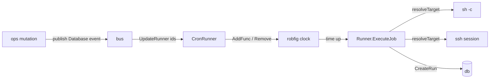

# `internal/cron`

**Files:** `cron/cron.go` (scheduler), `cron/runner.go` (execution)

## Purpose

Two related jobs live in this package:

- **`cron.go`** wraps `robfig/cron/v3` into Ritual's live scheduler and keeps it in
  sync with the database — the bridge between "rows in the Jobs table" and "things
  that actually fire on a schedule."
- **`runner.go`** actually executes a job's command (locally or over SSH) and records
  the result as a [`db.Run`](db.md). This is the "do the work" layer the scheduler and
  the `ritual run` CLI both reach.

## The scheduler (`cron.go`)

### `CronRunner`
```go
type CronRunner struct {
    Cron   *robfig.Cron
    Lookup map[int64]robfig.EntryID   // JobId → scheduler entry
}
```

The `Lookup` map is the key idea: robfig hands back an `EntryID` when you add a job,
and you need it to later remove/replace that entry. Keeping `JobId → EntryID` is what
makes edit/delete reach the running scheduler.

- **`MakeRunner`** — creates the cron, loads all jobs from [`db`](db.md), adds them.
- **`AddJobs`** — for each enabled job, registers an `AddFunc(schedule, closure)`. The
  closure builds a `Runner{Job: job}` and calls `ExecuteJob`, logging errors. The
  returned `EntryID` is stored in `Lookup`. (The closure captures `job` by value, so an
  edit reschedules with a fresh snapshot — preserve that as this evolves.)
- **`UpdateRunner(ids)`** — reloads those jobs from the DB, removes their old entries,
  re-adds them. This is what an edit/create event triggers.
- **`RemoveRunnerJob(ids)`** — removes entries and drops them from `Lookup`.

The scheduler is driven by events: [`bus.CronSubscription`](bus.md) calls
`UpdateRunner` / `RemoveRunnerJob` / `Cron.Start` / `Cron.Stop` in response to bus
events published by [`ops`](ops.md).

## The executor (`runner.go`)

```go
type Runner struct {
    Job    db.Job
    Client *ssh.Client   // nil ⇒ run locally
}
```

`ExecuteJob` owns the bookkeeping; `resolveTarget` and `runCommand` own the difference
between local and remote:

1. record start time, seed a `db.Run`;
2. **`resolveTarget`** decides where to run by `Job.Host`:
   - `""` → error ("invalid host");
   - `"localhost"` → run locally (`Client` stays nil);
   - anything else → look the host up via [`db.GetHost`](db.md), read its private key,
     build an `ssh.ClientConfig` (key auth + `~/.ssh/known_hosts` checking), and dial —
     storing the live `*ssh.Client` on the `Runner`.
3. **`runCommand`** prepends `export KEY='val'` lines for the job's `Env`, then runs the
   command: `sh -c` + `CombinedOutput` locally, or an `ssh.Session` + `CombinedOutput`
   remotely. A non-zero exit is **recorded, not treated as a failure** (exit code pulled
   from `*exec.ExitError` / `*ssh.ExitError`).
4. write the `db.Run` (timing, duration, exit code, logs).



## Status & future

From [TODO.md](../TODO.md):

- **`ritual run <id>` is broken** — the CLI builds `cron.Runner{}` without setting
  `.Job`, so `resolveTarget` always errors and the fetched job never runs
  (`cmd/cli.go:209-210`).
- **Imported jobs don't dispatch** — `resolveTarget` treats any host other than
  `"localhost"`/`""` as a remote SSH host, but the crontab importer stores `Host` = the
  machine's real hostname, which has no `Hosts` row. Needs a shared `isLocal(host)`
  helper so import and execution agree.
- **`runCommand`'s error is discarded** (staticcheck SA4006) — overwritten by
  `CreateRun()` before it's checked, so non-exit failures are lost.
- **Runs don't update the Job** — `ExecuteJob` writes only a `Runs` row; `LastRun`/
  `NextRun` on the Job are never stamped (`CalcNextRun` is defined but unused).
- **`UpdateRunner` does `Stop()`/`Start()`** around the swap, which makes robfig
  recompute `@every` next-runs from "now" → relative schedules drift on every edit.
  Should use live `AddFunc`/`Remove`.
- No per-job timeout (`exec.CommandContext`), overlap guard, or `recover()` around runs
  yet — all tracked in TODO.
- Logging nit: a duplicated "cron runner jobs updated" line (also logged in
  [`bus`](bus.md)).
