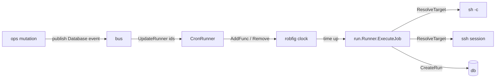

# `internal/cron`

**File:** `cron/cron.go` (scheduler)

## Purpose

Wraps `robfig/cron/v3` into Ritual's live scheduler and keeps it in sync with the
database — the bridge between "rows in the Jobs table" and "things that actually fire on
a schedule." Execution itself lives in a separate package, [`internal/run`](run.md); the
scheduler's closure builds a `run.Runner` and calls `ExecuteJob`.

## The scheduler (`cron.go`)

### `CronRunner`
```go
type CronRunner struct {
    Cron   *robfig.Cron
    Lookup map[int64]robfig.EntryID   // JobId → scheduler entry
}
```

The `Lookup` map is the key idea: robfig hands back an `EntryID` when you add a job,
and you need it to later remove/replace that entry. Keeping `JobId → EntryID` is what
makes edit/delete reach the running scheduler.

- **`MakeRunner`** — creates the cron, loads all jobs from [`db`](db.md), adds them.
- **`AddJobs`** — for each enabled job, registers an `AddFunc(schedule, closure)`. The
  closure builds a `Runner{Job: job}` and calls `ExecuteJob`, logging errors. The
  returned `EntryID` is stored in `Lookup`. (The closure captures `job` by value, so an
  edit reschedules with a fresh snapshot — preserve that as this evolves.)
- **`UpdateRunner(ids)`** — reloads those jobs from the DB, removes their old entries,
  re-adds them. This is what an edit/create event triggers.
- **`RemoveRunnerJob(ids)`** — removes entries and drops them from `Lookup`.

The scheduler is driven by events: [`bus.CronSubscription`](bus.md) calls
`UpdateRunner` / `RemoveRunnerJob` / `Cron.Start` / `Cron.Stop` in response to bus
events published by [`ops`](ops.md).

Execution is documented in [run.md](run.md).



## Status & future

See [TODO.md](../TODO.md) for the live queue.

- `UpdateRunner`/`RemoveRunnerJob` use live `Cron.Remove` + re-add (not a full
  `Stop()`/`Start()` swap), so relative `@every` schedules no longer drift on every edit.
- The `Cron.Start()`/`Cron.Stop()`-over-bus handling for `LifeCycle` events
  (`cron.go:85-87`) is currently unreachable — nothing publishes `bus.PUT`/`DELETE`.
