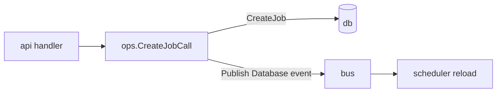

# `internal/ops`

**File:** `ops/ops.go`

## Purpose

The shared **operations layer** — the typed "verbs" of Ritual (create a job, publish
events) that contain the real logic, independent of any transport. HTTP handlers in
[`api`](api.md) are thin wrappers over these; the [scheduler](cron.md) and
[CLI](cmd.md) fallback can call them too. This is the layer the
[API design](../EXPLAIN.md) calls "one operation, many callers."

## How it works

### Request/response shapes
```go
type RequestBody struct {
    Jobs   []db.Job
    Events []bus.Event
    Host   string
}
type Result       struct { JobId int64; JobName string; Code int; Error string }
type ResponseBody struct { Results []Result }
```

These are the JSON envelopes that cross the socket/TCP boundary (marshaled at the
[`api`](api.md) edge, never inside the operation).

### Operations
- **`CreateJobCall`** — validates the request has jobs, calls `CreateJob()` on each,
  accumulates a per-job `Result` (code 0 ok / 1 error). Then, for the jobs that
  succeeded, it marshals their IDs and **publishes one `Database`/`POST` event** to
  [`bus.GlobalBus`](bus.md) so the live scheduler reloads them. Publishing here (in
  `ops`, after a successful write) — never in [`db`](db.md) — is the layering rule
  that keeps `db` pure.
- **`PublishEvents`** — forwards a batch of `bus.Event`s straight to the bus. This is
  what the CLI's `/api/publish` notify path lands on.



## Status & future

- `CreateJobCall` is implemented but **not yet wired in from the CLI** — `create`/
  `import` write the DB directly and only *notify* via `PublishEvents`. The intended
  end state routes CLI mutations through `ops` over the socket, with the direct DB
  write kept as the daemon-down fallback (TODO — Features).
- This is the natural home for the rest of the verbs (update, delete, pause/resume,
  run-now) as those CLI/web surfaces get built, so logic stays out of the handlers
  and out of [`web`](web.md).
</content>
