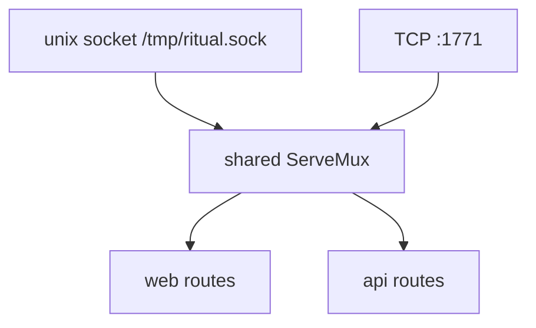

# `internal/srv`

**File:** `srv/srv.go`

## Purpose

Owns the HTTP plumbing: the shared `ServeMux` and the **two listeners** that expose
it — a unix domain socket (the CLI control plane) and a TCP port (the browser web
UI). Also provides the client the CLI uses to dial the socket.

## How it works

### One mux, two listeners
```go
func MakeMux() {
    Mux = http.NewServeMux()
    web.Register(Mux)   // HTML routes  (/jobs, …)
    api.Register(Mux)   // JSON routes  (/api/…)
}
```

The same mux holds both [`web`](web.md) and [`api`](api.md) routes; the two listeners
differ only in **exposure**, not in what they serve:

- **`SocketServe`** — removes any stale socket file, `net.Listen("unix",
  "/tmp/ritual.sock")`, then `http.Serve(ln, Mux)`. This is the local control plane
  (filesystem permissions are the auth). Browsers can't speak to a unix socket, which
  is exactly why there's also a TCP listener.
- **`WebServe`** — loads templates, then a configured `http.Server` on `:1771` with
  read/write/idle timeouts.

### The socket client
**`NewSocketClient`** returns an `*http.Client` whose transport dials the unix socket
regardless of the URL host — so the CLI can make ordinary `client.Post("http://unix/
api/publish", …)` calls that actually travel over the socket. This is the "HTTP over
unix socket" (Docker-style) model that lets the same handlers serve CLI and browser.



## Status & future

- **Shutdown doesn't drain.** Both `WebServe` and `SocketServe` use `log.Fatal`,
  which `os.Exit`s from a goroutine and bypasses the signal-driven block in
  [`cmd serve`](cmd.md) — so cron, the servers, and the socket file aren't cleanly
  stopped. The intended fix is to return errors (errgroup / error channel) and do a
  graceful `srv.Shutdown(ctx)` + `cron.Stop()` + `db.Close()` (TODO — Bugs).
- **Globals:** `Mux` (here) and `GlobalBus` (in [`bus`](bus.md)) are package globals —
  flagged to move toward dependency injection per the API design notes.
- The socket is created world-default; a `chmod 0660` for access control is planned.
- `MakeMux` must be called before the servers start (it is, in `serve`); an earlier
  build had it defined-but-uncalled, leaving a nil mux — keep that wiring intact.
</content>
